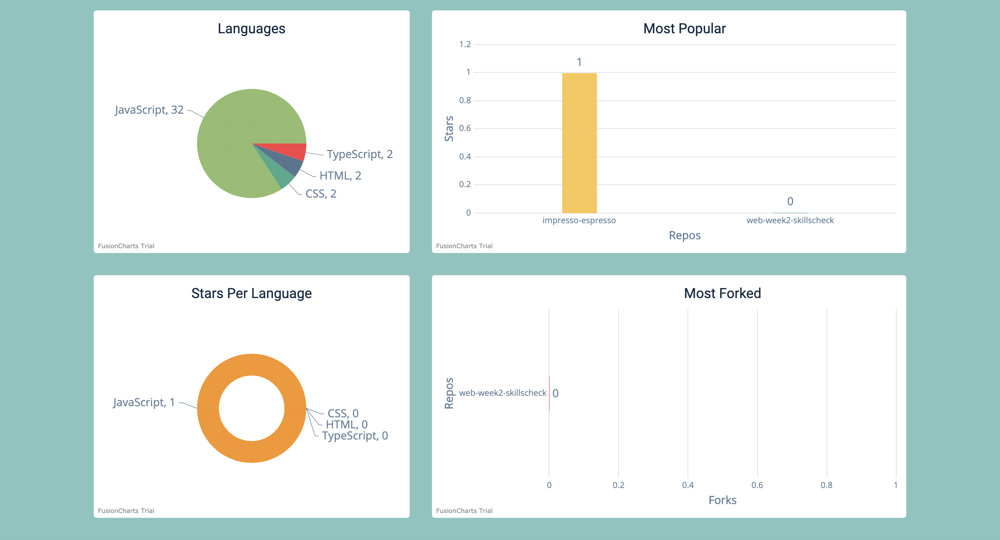

## [See live](https://ct-github-book.netlify.app/)

 

### The Stack

- Programming Language - JavaScript
- Frontend - React & Styled Components
- State Management - Context API
- Authentication - Auth0
- Routing - React-Router-Dom
- Charts - Fusion Charts
- External API - GitHub API
- Styling - CSS
- Hosting - Netlify

 

### This is a way to search for GitHub users. It will allow you to view the user's languages, most popular repos, stars per language as well as most fork repos. This application also shows you a users total repos, total followers and how many people they are following.

 

